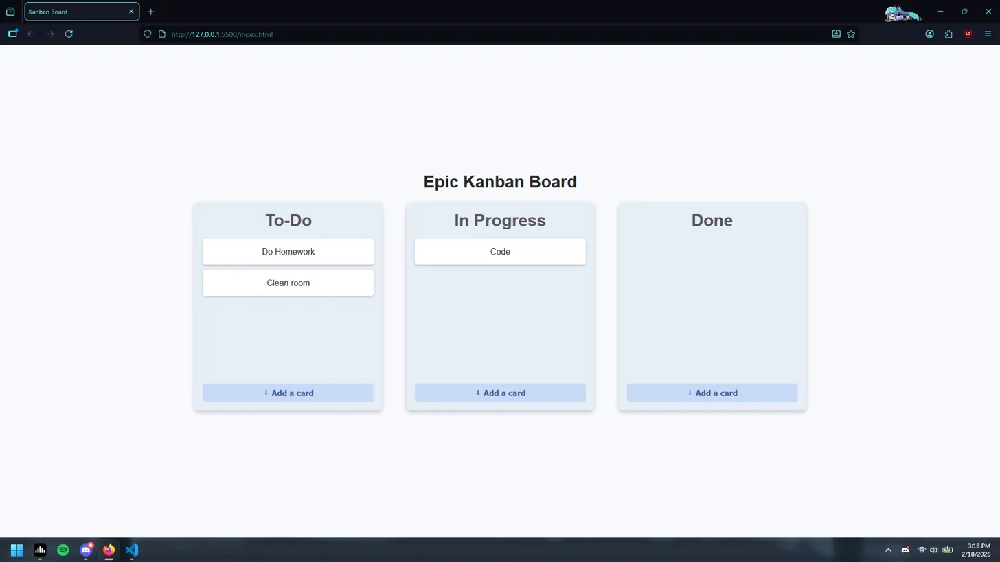

# Epic Kanban Board

A simple, interactive Kanban board built with vanilla HTML, CSS, and JavaScript. Drag and drop tasks between columns, add new cards, and delete tasks using the trash zone.



---

## Features

- **Drag & Drop** — Move cards between the To-Do, In Progress, and Done columns
- **Add Tasks** — Click "+ Add a card" in any column to create a new task
- **Trash Zone** — Drag a card to the trash zone at the bottom of the screen to delete it
- **Responsive** — Works on both desktop and mobile screens

---

## Project Structure

```
kanban-board/
├── index.html      # Main HTML structure
├── style.css       # All styling
└── board.js        # Drag & drop logic and task management
```

---

## Getting Started

No installation or dependencies required — it's pure HTML, CSS, and JS!

1. Clone the repository:
   ```bash
   git clone https://github.com/your-username/kanban-board.git
   ```
2. Open `index.html` in your browser, or use a local dev server like [Live Server](https://marketplace.visualstudio.com/items?itemName=ritwickdey.LiveServer) in VS Code.

---

## How to Use

**Moving a task**
Drag any card and drop it into another column.

**Adding a task**
Click the **+ Add a card** button at the bottom of any column, type your task, then press **Enter** or click **Add Task**. Press **Escape** to cancel.

**Deleting a task**
Start dragging any card — a trash zone will appear at the bottom of the screen. Drop the card onto it to delete it.

---

## Built With

- HTML5 (Drag and Drop API)
- CSS3 (Flexbox, transitions, animations)
- Vanilla JavaScript (no frameworks or libraries)

---

## License

This project is open source and available under the [MIT License](LICENSE).
